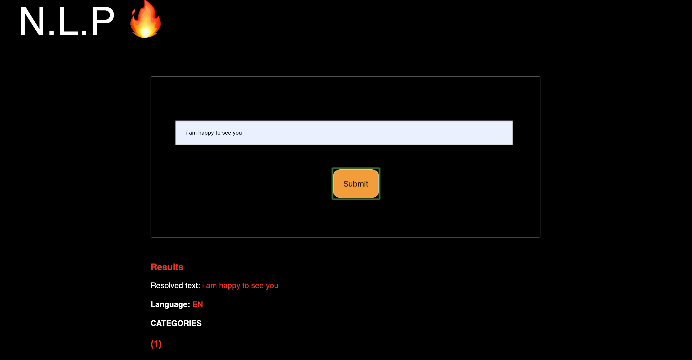
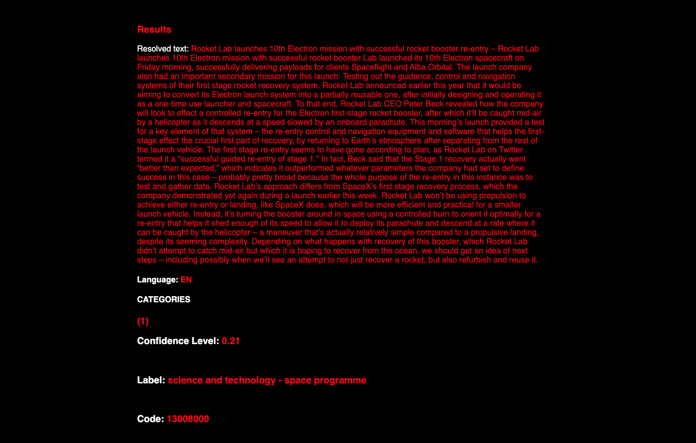

# Evaluate-News-Nlp

  
  

 

# Demo
You can find a demo [here](https://pensive-saha-5058c8.netlify.com)

# Introduction
This Project uses the Node SDK for the **Aylien Text API** to predict the specific label an article falls under. It can be Arts and Culture,Technology, etc. The confidence levels for the prediction are also communicated, and it handles predictions for plain text.

# Features
1. Out of the box offline functionality with service workers (workbox + webpack).
2. Minified css and js builds with webpack.
3. Proper unit testing with Jest.
